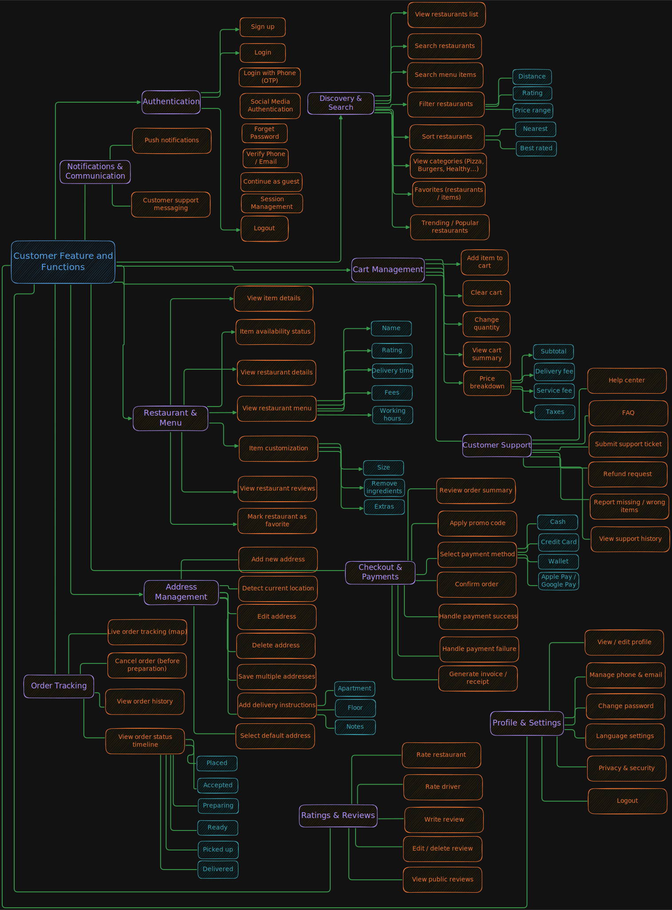
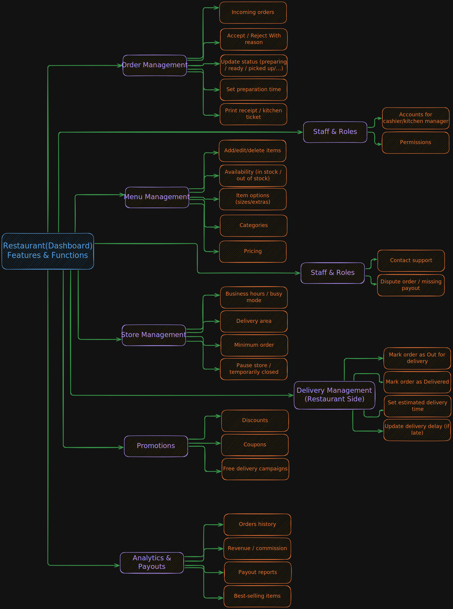
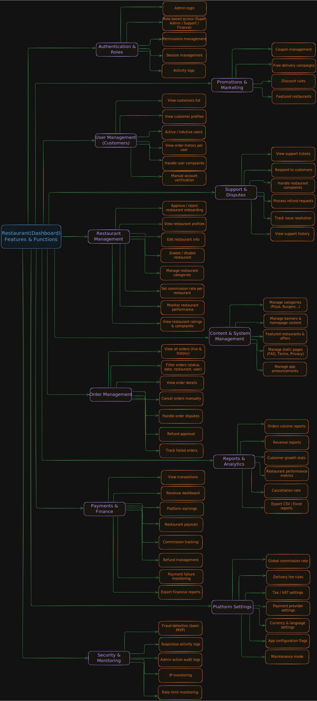
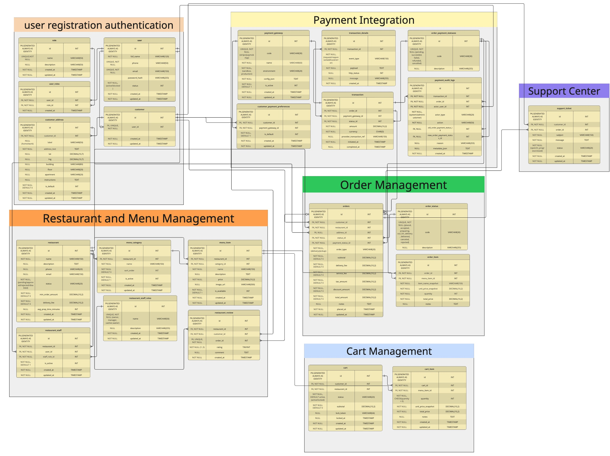
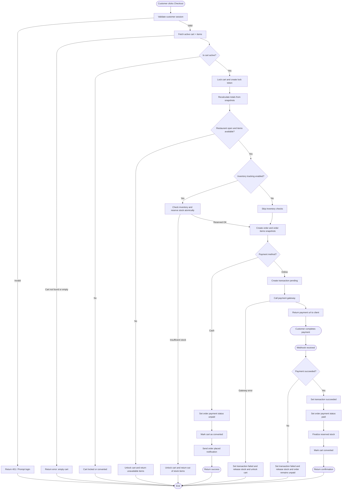
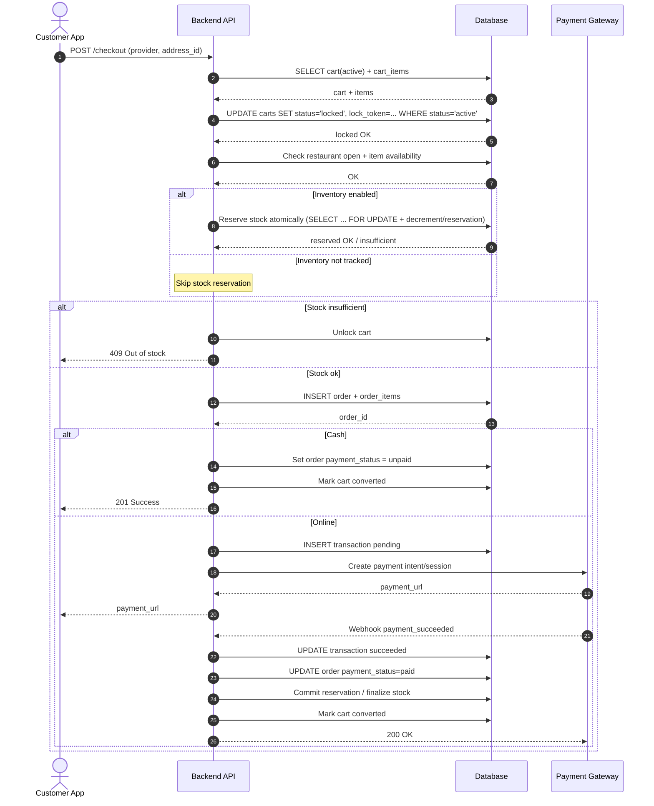

# Food Delivery Platform — System Design & Implementation (MVP)

This repository contains the **system analysis, documentation, and implementation** of a food delivery platform MVP.  
It covers the full journey from **product scope and feature breakdowns** to **backend/mobile code**, and will evolve with each milestone.

---

## Table of Contents

1. [Project Overview](#project-overview)
2. [MVP Scope](#mvp-scope)
3. [User Roles](#user-roles)
4. [Features & Functions](#features--functions)
5. [System Design](#system-design)
   - [Data Model (ERD)](#data-model-erd)
   - [Place Order – Detailed Design](#place-order--detailed-design)
6. [API Use Cases](#api-use-cases)
7. [Implementation](#implementation)
8. [Repository Structure](#repository-structure)
9. [Roadmap](#roadmap)
10. [Notes](#notes)

---

## Project Overview

A platform that connects customers with restaurants to browse menus, place orders, complete checkout, and track order status.  
In the MVP phase, **delivery is handled by restaurants** (no platform driver system in phase 1).

---

## MVP Scope

### Included

- Customer ordering experience (browse → cart → checkout → order tracking)
- Restaurant dashboard for managing orders, menus, store settings, promotions, and staff access
- Admin dashboard for managing platform operations (users, restaurants, orders, payments, disputes, settings)

### Not Included (Phase 1)

- Platform drivers / driver app
- Live driver map tracking (status-based tracking only)

---

## User Roles

- **Customer**
- **Restaurant**
- **Admin**

---

## Features & Functions

### Customer



### Restaurant



### Admin



---

## System Design

### Data Model (ERD)

The following ERD represents the MVP database design and the relationships between core entities.

<a href="./doc/ERD_V2.jpg" target="_blank">
  
</a>

---

### Place Order – Detailed Design

This section describes the end-to-end flow of the **Place Order** feature using multiple representations: flowchart, sequence diagram, and backend pseudocode.

#### 1) Flowchart



#### 2) Sequence Diagram



#### 3) Backend Pseudocode

```TEXT
function placeOrder(customerId, providerId, addressId, orderType):

  cart = db.getActiveCart(customerId)
  if cart == null or cart.items empty:
      return error(400, "Cart is empty")

  lockToken = randomToken()
  if !db.lockCart(cart.id, lockToken):
      return error(409, "Cart locked/converted")

  try:
      items = db.getCartItems(cart.id)

      # availability checks
      if !db.isRestaurantOpen(cart.restaurant_id):
          db.unlockCart(cart.id, lockToken)
          return error(409, "Restaurant closed")

      if db.hasUnavailableItems(items):
          db.unlockCart(cart.id, lockToken)
          return error(409, "Some items unavailable")

      # inventory checks (if tracked)
      if INVENTORY_ENABLED:
          # Important: do it atomically to prevent overselling
          # Example approach: SELECT ... FOR UPDATE then decrement/reserve
          if !db.reserveInventory(items):
              db.unlockCart(cart.id, lockToken)
              return error(409, "Out of stock")

      orderId = db.createOrderFromCart(cart, items, addressId, orderType)

      if provider is CASH:
          db.setOrderPaymentStatus(orderId, "unpaid")
          db.markCartConverted(cart.id, lockToken)
          # If inventory was reserved, you may finalize immediately for COD:
          if INVENTORY_ENABLED:
              db.commitInventoryReservation(orderId)
          return success(201, orderId)

      txId = db.createTransaction(orderId, providerId, status="pending")

      gatewayResp = paymentGateway.createPaymentIntent(orderId, txId)
      if gatewayResp.failed:
          db.setTransactionStatus(txId, "failed")
          if INVENTORY_ENABLED:
              db.releaseInventoryReservation(orderId)
          db.unlockCart(cart.id, lockToken)
          return error(502, "Payment gateway error")

      return success(200, payment_url=gatewayResp.url)

  catch e:
      # make sure cart isn't stuck
      db.unlockCart(cart.id, lockToken)
      if INVENTORY_ENABLED:
          db.releaseInventoryReservationIfAny()
      return error(500, "Unexpected error")
```

---

## API Use Cases

This document defines the main API use cases for the MVP.  
Each use case includes **endpoint signature, inputs, and expected outputs** without diving into implementation details.

### Authentication

```bash
* Sign Up
  - signature -> POST /api/v1/auth/signup
  - input -> {"fullName":"John Doe","email":"john@mail.com","password":"123456"}
  - output -> [201], {"userId": 1, "token":"..."}

* Login
  - signature -> POST /api/v1/auth/login
  - input -> {"email":"john@mail.com","password":"123456"}
  - output -> [200], {"token":"...", "userId": 1, "roles":["customer"]}

* Logout
  - signature -> POST /api/v1/auth/logout
  - input -> {}
  - output -> [200]
```

### Customer

```bash
* Get Profile
  - signature -> GET /api/v1/customers/profile
  - input -> {}
  - output -> [200], {"id":10,"fullName":"John","phone":"+970...","email":"john@mail.com"}

* Update Profile
  - signature -> PATCH /api/v1/customers/profile
  - input -> {"fullName":"John Updated"}
  - output -> [200]

* List Addresses
  - signature -> GET /api/v1/customers/addresses
  - input -> {}
  - output -> [200], [{"id":8,"label":"home","addressText":"..." }]

* Create Address
  - signature -> POST /api/v1/customers/addresses
  - input -> {"label":"home","addressText":"...","lat":31.5,"lng":35.1,"isDefault":true}
  - output -> [201], {"addressId":8}

* Update Address
  - signature -> PATCH /api/v1/customers/addresses/{addressId}
  - input -> {"label":"work"}
  - output -> [200]

* Delete Address
  - signature -> DELETE /api/v1/customers/addresses/{addressId}
  - input -> {}
  - output -> [200]
```

### Discovery & Restaurants (Customer-facing)

```bash
* Browse Restaurants
  - signature -> GET /api/v1/restaurants
  - input -> {"query?":"","page?":1,"limit?":20}
  - output -> [200], [{"id":3,"name":"Pizza Place","rating":4.6,"deliveryFee":2.0}]

* Restaurant Details
  - signature -> GET /api/v1/restaurants/{restaurantId}
  - input -> {}
  - output -> [200], {"id":3,"name":"Pizza Place","status":"approved","minOrderAmount":20}

* Restaurant Menu
  - signature -> GET /api/v1/restaurants/{restaurantId}/menu
  - input -> {}
  - output -> [200], {"categories":[...],"items":[...]}
```

### Cart Management

```bash
* Add Item To Cart
  - signature -> POST /api/v1/cart/items
  - input -> {"menuItemId":15,"quantity":2,"notes":"No onions"}
  - output -> [201], {"cartId":10,"cartItemId":55}

* Update Cart Item
  - signature -> PUT /api/v1/cart/items/{cartItemId}
  - input -> {"quantity":3,"notes":"Extra cheese"}
  - output -> [200]

* Remove Cart Item
  - signature -> DELETE /api/v1/cart/items/{cartItemId}
  - input -> {}
  - output -> [200]

* View Cart
  - signature -> GET /api/v1/cart
  - input -> {}
  - output -> [200], {"cartId":10,"restaurantId":3,"subtotal":24.50,"items":[...]}

* Clear Cart
  - signature -> POST /api/v1/cart/clear
  - input -> {}
  - output -> [200]
```

### Order Management (Customer)

```bash
* Place Order
  - signature -> POST /api/v1/orders
  - input -> {"orderType":"delivery","addressId":8,"providerId":2,"notes":"Call before arrival"}
  - output ->
    (Cash)   -> [201], {"orderId":120}
    (Online) -> [200], {"orderId":120,"paymentUrl":"https://gateway.com/pay/abc"}

* Get Order Details
  - signature -> GET /api/v1/orders/{orderId}
  - input -> {}
  - output -> [200], {"id":120,"status":"preparing","paymentStatus":"pending","total":28.75}

* Order History
  - signature -> GET /api/v1/orders/history
  - input -> {"page?":1,"limit?":20}
  - output -> [200], [{"id":120,"status":"delivered","total":28.75}]

* Cancel Order (before preparation)
  - signature -> POST /api/v1/orders/{orderId}/cancel
  - input -> {"reason":"Changed my mind"}
  - output -> [200]
```

### Payment

```bash
* List Payment Gateways
  - signature -> GET /api/v1/payments/gateways
  - input -> {}
  - output -> [200], [{"id":1,"code":"cash","name":"Cash"},{"id":2,"code":"stripe","name":"Card"}]

* View Order Transactions
  - signature -> GET /api/v1/orders/{orderId}/transactions
  - input -> {}
  - output -> [200], [{"id":50,"status":"succeeded","amount":28.75,"currency":"USD"}]

* Payment Webhook (Gateway → Backend)
  - signature -> POST /api/v1/webhooks/payments/{gatewayCode}
  - input -> { "providerPayload": "..." }
  - output -> [200]
```

### Restaurant Dashboard (Restaurant Staff)

```bash
* Restaurant Orders (incoming / active)
  - signature -> GET /api/v1/restaurant/orders
  - input -> {"status?":"new","page?":1,"limit?":20}
  - output -> [200], [{"id":120,"status":"placed","total":28.75}]

* Accept / Reject Order
  - signature -> POST /api/v1/restaurant/orders/{orderId}/decision
  - input -> {"decision":"accept"} OR {"decision":"reject","reason":"Kitchen busy"}
  - output -> [200]

* Update Order Status
  - signature -> POST /api/v1/restaurant/orders/{orderId}/status
  - input -> {"status":"preparing"} OR {"status":"ready"} OR {"status":"out_for_delivery"} OR {"status":"delivered"}
  - output -> [200]

* Create Menu Category
  - signature -> POST /api/v1/restaurant/menu/categories
  - input -> {"name":"Burgers","sortOrder":1}
  - output -> [201], {"categoryId":7}

* Create Menu Item
  - signature -> POST /api/v1/restaurant/menu/items
  - input -> {"categoryId":7,"name":"Classic Burger","price":12.25}
  - output -> [201], {"menuItemId":15}

* Update Menu Item Availability
  - signature -> PATCH /api/v1/restaurant/menu/items/{menuItemId}
  - input -> {"isAvailable":false}
  - output -> [200]

* Update Store Settings
  - signature -> PATCH /api/v1/restaurant/settings
  - input -> {"minOrderAmount":20,"deliveryFee":2.0,"avgPrepTimeMinutes":25}
  - output -> [200]
```

### Support

```bash
* Create Ticket
  - signature -> POST /api/v1/support/tickets
  - input -> {"orderId": 120, "subject": "Wrong item received", "message": "I got a different drink"}
  - output -> [201], {"ticketId": 33}

* View My Tickets (Customer)
  - signature -> GET /api/v1/support/tickets
  - input -> {"status?":"open"}
  - output -> [200], [{"id":33,"status":"open","subject":"Wrong item received"}]

* Update Ticket Status (Admin/Support)
  - signature -> POST /api/v1/admin/support/tickets/{ticketId}/status
  - input -> {"status":"in_progress","note":"We are checking with the restaurant"}
  - output -> [200]

```

#### Notes

    •	Status codes follow REST conventions
    •	Authentication headers required for all customer endpoints
    •	Checkout flow depends on cart lock mechanism
    •	Payment may return URL or direct confirmation

## Implementation

> The codebase will include the platform implementation and supporting modules.

- Backend services (APIs, database, authentication, orders, payments)
- Client apps (customer-facing)
- Dashboards (restaurant + admin)

---
